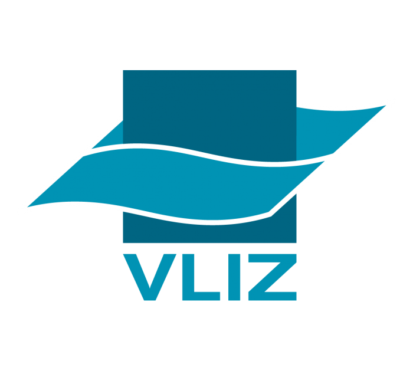
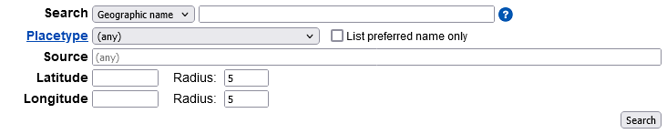
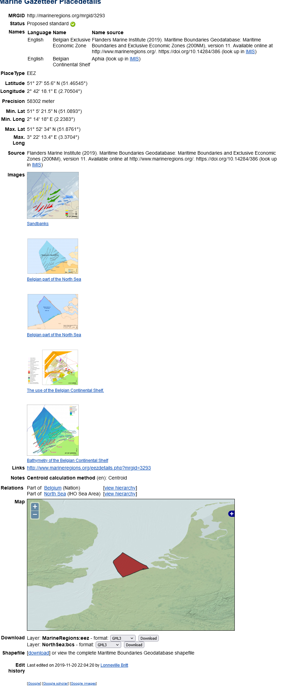
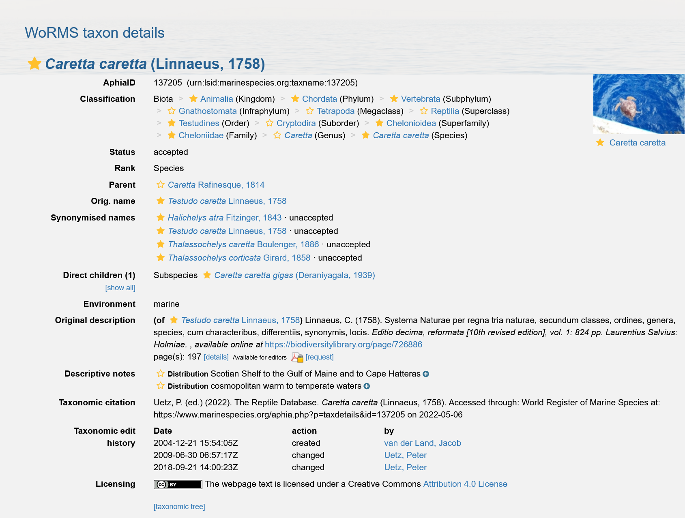

```{r setup, include=FALSE}
knitr::opts_chunk$set(echo = FALSE)
```


 

##  Bringing together marine biodiversity, environmental and maritime boundaries data in R
Salvador Fernandez 
Laura Marquez

May 30th 2022

 
 

## Proper collection allow humans and machines to find the data 

{width=60%}

## Reusing data leads to discovery, innovation & scientific integration


## FAIR principles


## We will learn

 1. How to access, query and obtain the data 

 2. Visualize and get them ready for further exploration and analyses   

 3. To use R packages: lwdataexplorer, eurobis, worrms, mregions, sdmpredictors

## Exercises of today


  1. Access marine regions data

  2. Get data from marine species from LifeWatch

  3. Get data from species in EurOBIS

  4. Access seabed habitat and human activities from EMODnetWFS  


## 1. Access marine regions data

The Marine Regions Gazetteer is a standard list of marine georeferenced place names.

> Gazetteer: a dictionary of geographical names.

<small>https://www.thefreedictionary.com/gazetteer</small>




## Gazetteer

Every record has an unique identifier: MRGID

e.g. The Belgian Exclusive Economic Zone has the MRGID 2350

`https://marineregions.org/gazetteer.php?p=details&id=2350`

## Gazetteer



## mregions2

The `mregions2` R package can download the Gazetteer record into R. Just pass the MRGID:

```{r mr_gaz_record}
library(mregions2)
library(magrittr)

bpns <- mr_gaz_record(2350)
bpns
```

## mregions2

If there is a geometry available, the record retrieved has the class `sf`. This means that is ready to be used with most of the R spatial libraries.

```{r mr_gaz_record2}
# library(mapview)

# mapview(bpns)
```

## Exercise 1: use mregions2

`./src/exercises/01_mregions`

```{r exercise1_mregions2, results='asis', echo=FALSE}
cat(c("```r", readLines("../exercises/01_mregions.R"), "```"), sep = "\n")
```


## 2. Get data from marine species from LifeWatch

lwdataexplorer retrieves biodiversity, environmental or genetic data from the projects supported by LifeWatch Belgium, a virtual laboratory for biodiversity research

```{r lwdataexplorer1}
# Example: get cetaceans and sonar high frequency data (CPOD)
# More info: vignette("lwdata_cpod")
# All the vignettes available: vignette(package = "lwdataexplorer")
library(lwdataexplorer)

flowcam <- getStationData("2022-01-01", "2022-05-30")

dplyr::glimpse(flowcam)
```


## 2. Get data from marine species from LifeWatch

Exercise 2: `./src/exercises/02_lwdataexplorer.R`

```{r exercise2_lwdataexplorer, results='asis', echo=FALSE}
cat(c("```r", readLines("../exercises/02_lwdataexplorer.R"), "```"), sep = "\n")
```


## 3. Match species name with WoRMS

WoRMS is the [World Register of Marine Species](https://www.marinespecies.org/). Each taxon name has an unique identifier: the AphiaID.

Example: the Loggerhead sea turtle has the AphiaID 137205
`https://www.marinespecies.org/aphia.php?p=taxdetails&id=137205`


<small>License CC-BY-NC-SA 4.0. Retrieved from WoRMS: https://www.marinespecies.org/aphia.php?p=image&pic=116025&tid=137205</small>

## 3. Match species name with WoRMS

WoRMS is the [World Register of Marine Species](https://www.marinespecies.org/). Each taxon name has an unique identifier: the AphiaID.

Example: the Loggerhead sea turtle has the AphiaID 137205
`https://www.marinespecies.org/aphia.php?p=taxdetails&id=137205`



## 3. Match species name with WoRMS

You can use the `worrms` R package to perform a taxon match: you provide scientific names of species or other taxa, and `worrms` gives you all the data about this taxon in WoRMS, including its unique identifier the AphiaID

```{r worms1}
library(worrms)

turtle <- wm_records_taxamatch("Caretta caretta")
turtle
```


## 3. Match species name with WoRMS

Exercise 3: `./src/exercises/03_worrms.R`

```{r exercise3_worms1, results='asis', echo=FALSE}
cat(c("```r", readLines("../exercises/03_worrms.R"), "```"), sep = "\n")
```


## 4. Get data from species in EurOBIS

EurOBIS is the European Node of the international Ocean Biodiversity Information System. It provides access to distribution data of marine species.

The EurOBIS data can be retrieved via the `eurobis` R package.

The EurOBIS database uses Marine Regions and WoRMS as geographical and taxonomic backbones.

This means that you can ask for data of an specific taxon via the AphiaID, and data from an specific place with the Marine Regions Gazetteer Identifier or MRGID.

```{r eurobis1}
library(eurobis)

# Remember:
# MRGID of the North Sea: 2350
# AphiaID of the sea turtle Caretta caretta: 137205
eurobis_data <- eurobis_occurrences(
  type = "basic", 
  mrgid = 2350,
  startdate = "2021-01-01",
  enddate = "2022-01-01",
  aphiaid = 137205
)
```


## 4. Get data from species in EurOBIS

Exercise 4: `./src/exercises/04_eurobis.R`

```{r exercise4_eurobis1, results='asis', echo=FALSE}
cat(c("```r", readLines("../exercises/04_eurobis.R"), "```"), sep = "\n")
```


## 5. Access seabed habitat and human activities from EMODnetWFS

EMODnet is the European Marine Observation and Data Network. 

The eurobis R package uses the EMODnet-Biology webservices. But there are web services for the other types of data: physical, seabed habitats, human activities...

These data can be accessed all together from the `EMODnetWFS` R package. 
WFS stands for Web Feature Service. This means that provides access to vector data.
We are working on including also raster data. This will be available later this year.

```{r emodnetwfs1}
library(EMODnetWFS)

# Check services available
emodnet_wfs()

# Start by creating a client (this will improve the performance)
physics_client <- emodnet_init_wfs_client("physics")

# Explore the layers available
emodnet_get_wfs_info(physics_client)

# Download the layer EMODnet Physics - DB of the platforms  
# collecting Water Acoustic Pollution/Noise
noise <- emodnet_get_layers(
  wfs = physics_client, 
  layers = "EP_GEO_INT_UWNO_AL_PP_GLO", 
  reduce_layers = TRUE
)
```

## 5. Access seabed habitat and human activities from EMODnetWFS
```{r emodnetwfs2}
dplyr::glimpse(noise)
```


## 5. Access seabed habitat and human activities from EMODnetWFS
```{r emodnetwfs3}
library(mapview)

mapview(noise)
```

## 5. Access seabed habitat and human activities from EMODnetWFS

Exercise 5: `./src/exercises/05_emodnetwfs.R`

```{r exercise5_emodnetwfs1, results='asis', echo=FALSE}
cat(c("```r", readLines("../exercises/05_emodnetwfs.R"), "```"), sep = "\n")
```


## END!


```{r render, include = FALSE, eval = FALSE}
rmarkdown::render("slides.Rmd", output_dir = "../../docs", output_file = "index.html")
```