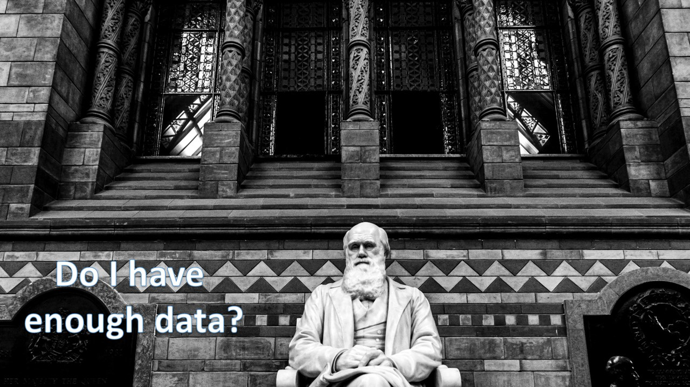

```{r setup, include=FALSE}
knitr::opts_chunk$set(echo = TRUE)
knitr::opts_chunk$set(collapse = TRUE)
```


<div style="font-size: 43px;" >
Bringing together marine biodiversity, environmental and maritime boundaries data in R
</div>

Salvador Fernandez, 
Laura Marquez, 
Lotte Pohl

May 30th 2022

<button style="width:26%">
  
</button>

<button style="width:26%">
  
</button>

---


<!-- <div style="font-size:25px"> </div> -->

Many more workshops! Discover [*here*](https://www.biodiversity.be/5147/)

 - June 9, 9:30 - 16:30 (register [*here*](https://tinyurl.com/yckurpft)) <br>*Linking occurrence data with environmental variables from the ecotopes*
 - June 29, 09:00 - 17:00 (register [*here*](https://forms.gle/eHsQFze8sLJzPnxq9))<br>*Explore GBIF from the Cloud*
 
 - September 27, 09:30 - 16:30 (register [*here*](https://docs.google.com/forms/d/1SFvlAdIe0YviE7tW0uSffFo7TvnI5S27I-844rWeT00/edit))<br>*Research Data Management workshop: Hands-on introductions to research data management and  publication*
 

<!-- <br> -->

<!-- Workshop 7 organised by [**INBO**](https://www.vlaanderen.be/inbo/en-gb/homepage/):   -->
<!-- <br> -->
<!-- FAIR biodiversity data: what, why and how? -->
<!-- <br> -->
<!-- June 2, 10 - 12 a.m -->
<!-- <br> -->
<!-- Register [**here**](https://tinyurl.com/3d2z6nkm) -->
<!-- write about INBO workshop in Email -->

# The Story

<!-- Having rapid access to reliable and accurate information is vital in different areas: conservation, research, and in creating policies and legislation to protect vulnerable areas of our coasts and oceans. 

(1) However, we have several sources of information where we can obtain a diverse set of data from and different ways to obtain it. 

so the question is what is the workflow that allows us to obtain data and work with it in the most easy straightforward way possible? -->


<!-- ## The Story -->

<!-- There is a diverse set of stakeholders, from academia, industry, funding agencies and scholarly publishers can benefit from having a workflow to access standardized marine biological, chemical, physical, and other different types of data. -->

<!--  -->

## The Story
<!-- An important user of the databases that we are going to work with today is the scientific community. For scientists, obtaining this kind of information is useful to create the basis of different projects or even to obtain data they need to carry them out. Some of the questions that arise for them when creating such projects are -->



## The Story


## The Story


## The Story


## Who we are

<button style="width:26%">
  
  <br> <div style="font-size:30px">Salva Fernandez</div> <br/> <div style="font-size:25px">VLIZ <br/>Science Officer</div><br/><div style="font-size:20px"> salvador.fernandez@vliz.be</div>
</button>

<!-- mention that we (Salva) are maintaining R packages in case you have any questions about that either now or in the future -->

<button style="width:43%">
  
  <br> <div style="font-size:30px">Laura Marquez</div> <br/> <div style="font-size:25px">VLIZ <br/>Science Officer</div><br/><div style="font-size:20px"> laura.marquez@vliz.be</div>
</button>

<button style="width:25%">
  
  <br><div style="font-size:30px">Lotte Pohl</div> <br/> <div style="font-size:25px">VLIZ/IMBRSea <br/>Intern</div><br/><div style="font-size:20px"> lotte.pohl@imbrsea.eu</div>
</button>

## The Species
<!-- To answer those type of questions is the aim of this workshop. We are going to learn how to query, access and obtain the data hold in different European Marine databases and for that we are going to work with some of the representative species: 
Anguila, carp, catfish, the common roach, codfish and flounder.
-->
<br/>
<br/>
<br/>
<br/>


<!-- <button style="width:27%"> -->
<!--    -->
<!-- </button> -->

<!-- <button style="width:30%"> -->
<!--    -->
<!-- </button> -->

<!-- <button style="width:30%"> -->
<!--    -->
<!-- </button> -->

<!--  -->

<!-- ## The Species -->
<!--  -->

<!-- ## The Species -->
<!--  -->

<!-- ## The Species -->
<!--  -->

<!-- ## The Species -->
<!--  -->

<!-- ## The Species -->
<!--  -->

## What we will learn

<!-- We will learn to visualize and get them ready for further exploration and analyses. All using the R packages available from different European initiatives: lwdataexplorer, eurobis, worrms, mregions, sdmpredictors.
-->
 1. Standardize your data
 
 2. Retrieve more data to include in analysis later on
 
 3. Get environmental data
 
 4. Combine it all into 1 dataset

 <!-- 1. How to access, query and obtain the data -->

 <!-- 2. Visualize and get them ready for further exploration and analyses using R -->

<!-- <br> -->
<!-- <br> -->

 - R packages: 
     - **lwdataexplorer** ([documentation](https://lifewatch.github.io/lwdataexplorer/index.html), [github](https://github.com/lifewatch/lwdataexplorer))
     - **eurobis** ([documentation](http://lifewatch.github.io/eurobis/), [github](https://github.com/lifewatch/eurobis))
     - **worrms** ([documentation](https://docs.ropensci.org/worrms/), [github](https://github.com/ropensci/worrms))
     - **mregions2** ([documentation](http://lifewatch.github.io/mregions2/), [github](https://github.com/lifewatch/mregions2/))
     - **sdmpredictors** ([documentation](http://lifewatch.github.io/sdmpredictors/), [github](https://github.com/lifewatch/sdmpredictors))
     - **emodnetWFS** ([documentation](https://emodnet.github.io/EMODnetWFS/), [github](https://github.com/EMODnet/EMODnetWFS/))


<!-- ## Exercises *(TBD)* -->

<!--   1. Get and standardize data -->

<!--       * [LifeWatch](https://lifewatch.be): Get marine taxon occurrences -->
<!--       * [WoRMS](https://www.marinespecies.org): Get standardised taxon info -->
<!--       * [marineregions](https://marineregions.org): Get standardised geospatial data -->

<!--   2. Get more occurrence data -->

<!--       * [EurOBIS](https://www.eurobis.org): Get marine taxon occurrences -->

<!--   3. Get environmental data -->

<!--       * [Bio-ORACLE](https://bio-oracle.org): Get pH, temperature & salinity -->
<!--       * [EMODnet Biology](https://emodnet-biology.eu): Get seabed habitats & human activities -->

<!--   4. Combine it all together -->

  
## Exercises
<br>


## Timeline (13:30 - 16:30)

  1. **Introduction** *(13:30 - 14:00)*
  
  2. **Exercise 1** *(14:00 - 14:45)*
  
  3. **Break** *(14:45 - 15:00)*
  
  4. **Exercise 2** *(15:00 - 15:30)*
  
  5. **Exercise 3** *(15:30 - 15:45)*
  
  6. **Break** *(15:45 - 16:00)*
  
  7. **Exercise 4** *(16:30 - 16:15)*
  
  8. **Close-off** *(16:15 - 16:30)*

## House Rules

 - Open the slides https://vlizbe.github.io/ebr-2022-data-combine
 - Open your RStudio project 
 - Make sure your environment (renv) is set up beforehand (link to tutorial)
 - Let's code!
 - You can share your code (hackmd.io/@fw0N_GjzTbeK4x4_tgcJLg/B1yOPbWD9) or discuss with others in the breakout room
 - Revision of each exercise
 - Any question you can drop it in the chat 

# Exercise 1


<!-- Speaker Note: Introduce ETN -->

**Use your own data!**

## Geospatial Data and Operations


<!-- <br/> -->
<!-- <br/> -->

<!-- <button style="width:45%"> -->
<!--    -->
<!--   <br> **spatial intersection** -->
<!-- </button> -->

<!-- <button style="width:45%"> -->
<!--    -->
<!--   <br> **spatial union** -->
<!-- </button> -->

<br/>

>[Coordinate Reference Systems (CRS)](https://docs.qgis.org/2.18/en/docs/gentle_gis_introduction/coordinate_reference_systems.html) provide a standardized way of describing locations.
<br> 
<small>https://www.nceas.ucsb.edu</small>
<!--  -->


## AphiaID and MRGID

<br/>
<br/>

<button style="width:40%">
  
  <br> **AphiaID**<br>Unique identifier of a taxon<br/> https://www.marinespecies.org/aphia.php?p=image&pic=116025&tid=137205 
</button>

<button style="width:40%">
  
  <br>Marine Regions Geographic IDentifier (**MRGID**)<br />Unique identifier of an entry in the [marineregions.org](https://marineregions.org/mrgid.php) database
</button>

## Exercise 1

```{r exercise1, results='asis', echo=FALSE}
cat(c("```r", readLines("../exercises/01_standarize.R"),"```"), sep = "\n")
```

<!-- ## Notes: -->

<!--   - LifeWatch Belgium: a virtual laboratory for biodiversity research -->
<!--   - `lwdataexplorer` R package: retrieves biodiversity, environmental or genetic data from projects supported by LifeWatch -->
 <!-- - WoRMS: [World Register of Marine Species](https://www.marinespecies.org/). -->
 <!-- - Aphia ID: Unique identifier for each taxon -->
 <!-- - `worrms` R package: performs taxon match -->
 <!-- - input: scientific name of species or other taxa -->
 <!-- - output: all data about that taxa in WoRMS, including the AphiaID  -->
 <!-- - If geometry data is available: retrieved record in R has class `sf` -->
 <!-- - `sf`: format used for spatial operations -->

# 15 min. Break!

<br/>


# Exercise 2


<!-- ## Dplyr -->

<!--  - works with pipes (`%>%`) to increase code readability and avoid nesting -->
<!--  - `mean(as.numeric(df$temp))` translates to `df$temp %>% as.numeric() %>% mean()` -->
<!--  - cheatsheet [here](https://nyu-cdsc.github.io/learningr/assets/data-transformation.pdf) -->

<!--   -->

## Exercise 2


```{r exercise2, results='asis', echo=FALSE}
cat(c("```r", readLines("../exercises/02_eurobis.R"),"```"), sep = "\n")
```

<!-- ## Notes -->

<!--   - EurOBIS: European Node of the international Ocean Biodiversity Information System -->
<!--   - Provides access to distribution data of marine species -->
<!--   - `eurobis` R package: retrieves EurOBIS data -->
<!--   - Marine Regions = geographical backbone, WoRMS = taxonomic backbone -->
<!--   - Data can be accessed via the AphiaID for a specific taxon or the MRGID for a specific place -->
<!-- The EurOBIS database uses Marine Regions and WoRMS as geographical and taxonomic backbones. -->
<!-- This means that you can ask for data of an specific taxon via the AphiaID, and data from an specific place with the Marine Regions Gazetteer Identifier or MRGID. -->

# Exercise 3


<!-- ## Notes -->
<!--   - EMODnet: European Marine Observation and Data Network -->
<!--  - `eurobis` R package: uses the EMODnet-Biology webservices -->
<!--   - there are web services for other types of data:  -->
<!--    - physical -->
<!--    - seabed habitats -->
<!--    - human activities -->
<!--  - `EMODnetWFS` R package: can access all these data -->
<!--  - WFS: Web Feature Service (provides access to vector data) -->
<!--  - Accessing raster data: available later in 2022 -->

## Raster vs Vector Data
<br>
<br>
<br>

<button style="width:49%">
  
  <br><div style="font-size:30px"> raster layer</div>
</button>

<button style="width:49%">
  
  <br> <div style="font-size:30px">vector layer</div>
</button>

<!-- I know the raster img itself has poor resolution but I haven't figured out yet how to include vector images in revealjs -->

## Exercise 3

```{r exercise3, results='asis', echo=FALSE}
cat(c("```r", readLines("../exercises/03_environmental.R"),"```"), sep = "\n")
```

# 15 min. Break!

<br/>


# Exercise 4


## Attention


<!-- <br/> -->
<!-- <br/> -->

<!-- <button style="width:45%"> -->
<!--    -->
<!--   <br> **spatial intersection** -->
<!-- </button> -->

<!-- <button style="width:45%"> -->
<!--    -->
<!--   <br> **spatial union** -->
<!-- </button> -->

<br/>

**Attention:** `raster::extract()` and `sf::st_join` both do a spatial join. The former is used for raster data, the second one for vector data!


## Exercise 4

```{r exercise4, results='asis', echo=FALSE}
cat(c("```r", readLines("../exercises/04_combine.R"),"```"), sep = "\n")
```

# Recap: Data Sources


# Questions? Contact us!

<button style="width:26%">
  
  <br> <div style="font-size:30px">Salva Fernandez</div> <br/> <div style="font-size:25px">VLIZ <br/>Science Officer</div><br/><div style="font-size:20px"> salvador.fernandez@vliz.be</div>
</button>

<button style="width:43%">
  
  <br> <div style="font-size:30px">Laura Marquez</div> <br/> <div style="font-size:25px">VLIZ <br/>Science Officer</div><br/><div style="font-size:20px"> laura.marquez@vliz.be</div>
</button>

<button style="width:25%">
  
  <br><div style="font-size:30px">Lotte Pohl</div> <br/> <div style="font-size:25px">VLIZ/IMBRSea <br/>Intern</div><br/><div style="font-size:20px"> lotte.pohl@imbrsea.eu</div>
</button>

<br><br>
**And now have fun with the workshop!**

```{r render, include = FALSE, eval = FALSE}
rmarkdown::render("slides.Rmd", output_dir = "../../docs", output_file = "index.html")
```