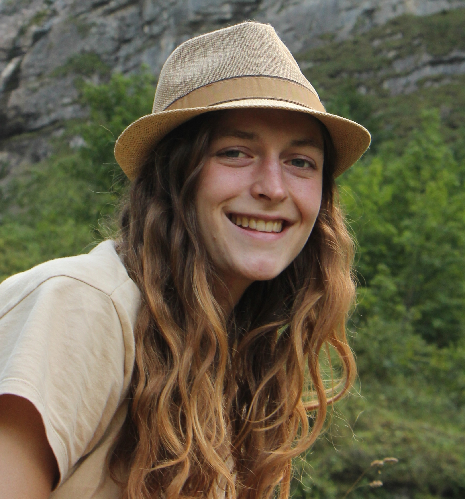
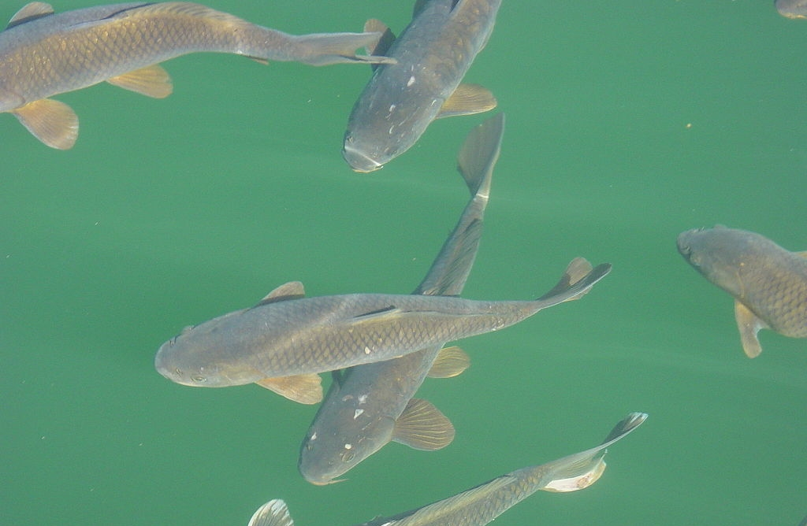

```{r setup, include=FALSE}
knitr::opts_chunk$set(
  collapse = TRUE,
  comment = "#>",
  cache = TRUE,
  warning=FALSE,
  message = FALSE
)
```


<div style="font-size: 30px;" >
Bringing together marine biodiversity, environmental and maritime boundaries data in R
</div>

Salvador Fernandez, 
Laura Marquez, 
Lotte Pohl

May 30th 2022


<!-- ```{r} -->
<!-- library(lwdataexplorer) -->
<!-- library(revealjs) -->
<!-- library(mregions2) -->
<!-- library(eurobis) -->
<!-- library(sdmpredictors) -->
<!-- library(worrms) -->
<!-- ``` -->

# The Story

<!-- Having rapid access to reliable and accurate information is vital in different areas: conservation, research, and in creating policies and legislation to protect vulnerable areas of our coasts and oceans. 

(1) However, we have several sources of information where we can obtain a diverse set of data from and different ways to obtain it. 

so the question is what is the workflow that allows us to obtain data and work with it in the most easy straightforward way possible? -->


## The Story

<!-- There is a diverse set of stakeholders, from academia, industry, funding agencies and scholarly publishers can benefit from having a workflow to access standardized marine biological, chemical, physical, and other different types of data. -->


## The Story
<!-- An important user of the databases that we are going to work with today is the scientific community. For scientists, obtaining this kind of information is useful to create the basis of different projects or even to obtain data they need to carry them out. Some of the questions that arise for them when creating such projects are -->


## The Story


## The Story


## The Story


## Who we are

<button style="width:26%">
  
  <br> **Salva Fernandez** <br/> VLIZ <br/>Science Officer<br/> salvador.fernandez@vliz.be
</button>

<button style="width:43%">
  
  <br> **Laura Marquez** <br /> VLIZ <br/>Science Officer<br/> laura.marquez@vliz.be
</button>

<button style="width:25%">
  
  <br> **Lotte Pohl** <br /> VLIZ/IMBRSea <br/>Intern<br /> lotte.pohl@imbrsea.eu 
</button>

## The Species
<!-- To answer those type of questions is the aim of this workshop. We are going to learn how to query, access and obtain the data hold in different European Marine databases and for that we are going to work with some of the representative species: 
Anguila, carp, catfish, the common roach, codfish and flounder.
-->
<!-- <button style="width:100%"> -->
<!--    -->
<!-- </button> -->


## The Species


## The Species


## The Species


## The Species


## The Species


## What we will learn

<!-- We will learn to visualize and get them ready for further exploration and analyses. All using the R packages available from different European initiatives: lwdataexplorer, eurobis, worrms, mregions, sdmpredictors.
-->

 1. How to access, query and obtain the data

 2. Visualize and get them ready for further exploration and analyses using R

<!-- <br> -->
<!-- <br> -->

 3. R packages: 
     - **lwdataexplorer** ([documentation](https://lifewatch.github.io/lwdataexplorer/index.html), [github](https://github.com/lifewatch/lwdataexplorer))
     - **eurobis** ([documentation](http://lifewatch.github.io/eurobis/), [github](https://github.com/lifewatch/eurobis))
     - **worrms** ([documentation](https://docs.ropensci.org/worrms/), [github](https://github.com/ropensci/worrms))
     - **mregions2** ([documentation](http://lifewatch.github.io/mregions2/), [github](https://github.com/lifewatch/mregions2/))
     - **sdmpredictors** ([documentation](http://lifewatch.github.io/sdmpredictors/), [github](https://github.com/lifewatch/sdmpredictors))
     - **emodnetWFS** ([documentation](https://emodnet.github.io/EMODnetWFS/), [github](https://github.com/EMODnet/EMODnetWFS/))

## Data Sources Overview


## Exercises *(TBD)*

  1. Get and standardize data
  
      * [LifeWatch](https://lifewatch.be): Get marine taxon occurrences
      * [WoRMS](https://www.marinespecies.org): Get standardised taxon info
      * [marineregions](https://marineregions.org): Get standardised geospatial data

  2. Get more occurrence data
  
      * [EurOBIS](https://www.eurobis.org): Get marine taxon occurrences

  3. Get environmental data
  
      * [Bio-ORACLE](https://bio-oracle.org): Get pH, temperature & salinity
      * [EMODnet Biology](https://emodnet-biology.eu): Get seabed habitats & human activities

  4. Combine it all together
  
  
## Exercises


## Timeline (13:30 - 16:30)

  1. **Introduction** *(13:30 - 14:00)*
  
  2. **Exercise 1** *(14:00 - 14:45)*
  
  3. **Break** *(14:45 - 15:00)*
  
  4. **Exercise 2** *(15:00 - 15:30)*
  
  5. **Exercise 3** *(15:30 - 15:45)*
  
  6. **Coffee Break** *(15:45 - 16:00)*
  
  7. **Exercise 4** *(16:30 - 16:15)*
  
  8. **Close-off** *(16:15 - 16:30)*

# Exercise 1: standardize


**Use your own data!**

## Dataset example: Belgian LifeWatch Observatory data

<!-- 
Collage different data
-->

## Dataset example: Belgian LifeWatch Observatory data

```{r lwdata1, results = 'hide'}
library(lwdataexplorer)

zoo <- getZooscanData("2021-01-01", "2022-01-01")

head(zoo)
```

```{r lwdata1-1, echo = FALSE}
library(kableExtra)

kbl(head(zoo)) %>%
  kable_paper() %>%
  scroll_box(width = "100%", height = "300px")
```

## Dataset example: Belgian LifeWatch Observatory data

We will transform the dataset into a **Simple Feature** object:

```{r lwdata2}
library(sf)

class(zoo)

zoo_sf <- st_as_sf(zoo, coords = c("Longitude", "Latitude"), crs = 4326, remove = FALSE)

class(zoo_sf)

```

sf cheatsheet: https://raw.githubusercontent.com/rstudio/cheatsheets/main/sf.pdf

>[Coordinate Reference Systems (CRS)](https://docs.qgis.org/2.18/en/docs/gentle_gis_introduction/coordinate_reference_systems.html) provide a standardized way of describing locations.
<br> 
<small>https://www.nceas.ucsb.edu</small>
<!--  -->

## Dataset example: Belgian LifeWatch Observatory data

```{r lwdata3}
plot(st_geometry(zoo_sf))
```


## Dataset example: Belgian LifeWatch Observatory data
<!-- 
ETN tracking data picture
-->
```r
etn <- getEtnData()
```


## Taxonomic match with WoRMS

<!-- Logo WoRMS and link -->
<!-- Two species names, one accepted and another that is not, each has an ID -->

## Taxonomic match with WoRMS
```{r worrms1, results = 'hide'}
library(worrms)

taxa <- wm_records_taxamatch("Caretta caretta")

taxa[[1]]

```

```{r worrms1-1, echo = FALSE}
library(kableExtra)

kbl(taxa[[1]]) %>%
  kable_paper() %>%
  scroll_box(width = "100%", height = "200px")
```

## AphiaID: Unique identifier of a taxon in WoRMS

```
https://www.marinespecies.org/aphia.php?p=taxdetails&id=137205
```


## Geographic standard: Marine Regions Gazetteer

<!-- Logo MR and link -->
<!-- Two regions with same name -->

## Geographic standard: Marine Regions Gazetteer

```{r mregions2-1, eval = FALSE}
library(mregions2)

# Find all Long beaches
mr_gaz_records_by_names("Long beach")

# Get only one
mr_gaz_record(32658)
```

```{r mregions2-1-1, echo = FALSE}
# TODO: fix mregions2
# library(kableExtra)
# 
# kbl(mr_gaz_record(32658)) %>%
#   kable_paper() %>%
#   scroll_box(width = "100%", height = "300px")
```

```{r mregions2-2, echo=FALSE}
# lb1 <- mr_gaz_record(32658)
# lb2 <- mr_gaz_record(57690)
# 
# lb <- rbind(lb1, lb2)
# 
# plot(lb)
```

## MRGID: Unique identifier of a record of the [marineregions.org](https://marineregions.org/mrgid.php) Gazetteer

```
https://marineregions.org/gazetteer.php?p=details&id=3293
```


## Spatial filtering

```{r mregions2-spfilter, eval=FALSE}
library(sf)
# bpns <- mr_gaz_record(32658)

# mapview(list(zoo_sf, bpns))

# st_intersection(zoo_sf, bpns)
```

<!-- get drawing or whatever to show spatial filter -->

## Exercise 1: Standardize

`./src/exercises/01_standardize.R`

```{r exercise1, results='asis', echo=FALSE}
cat(c("```r", readLines("../exercises/01_standarize.R"),"```"), sep = "\n")
```


# Exercise 2


## EurOBIS

Logo EurOBIS


## EurOBIS
Example: get all occurrences of the Atlantic Cod (_Gadus morhua_; aphiaID = 126436) in the Belgian Part of the North Sea (MRGID = 3293)

```{r eurobis1, results='hide'}
library(eurobis)
df <- eurobis_occurrences_basic(aphiaid = 126436, mrgid = 3293)
head(df)
```

```{r eurobis1-1, echo = FALSE}
kbl(head(df)) %>%
  kable_paper() %>%
  scroll_box(width = "100%", height = "300px")
```

## EurOBIS
```{r eurobis1-2}
plot(st_geometry(df))
```

## Data manipulation in R: dplyr

We will work with `dplyr`. It uses pipes (`%>%`) to increase code readability and avoid nesting

```r
# base R
df$datecollected <- as.Date(df$datecollected)
```

```r  
# dplyr
library(dplyr)
df <- df %>%
  mutate(datecollected = as.Date(datecollected))
```
cheatsheet: https://nyu-cdsc.github.io/learningr/assets/data-transformation.pdf


## Exercise 2

`./src/exercises/02_eurobis.R`

```{r exercise2, results='asis', echo=FALSE}
cat(c("```r", readLines("../exercises/02_eurobis.R"),"```"), sep = "\n")
```


# Exercise 3


## EMODnetWFS

Explore and download geospatial data from EMODnet. 

```{r emodnetwfs1, results='hide', message=FALSE}
library(EMODnetWFS)

client <- emodnet_init_wfs_client("human_activities")

class(client)
#> [1] "WFSClient"         "OWSClient"         "OGCAbstractObject" "R6"
```

More info at https://emodnet.github.io/EMODnetWFS/

## EMODnetWFS

```
emodnet_get_wfs_info(client)
```

```{r emodnetwfs2-1, echo = FALSE}
kbl(emodnet_get_wfs_info(client)[1:50,]) %>%
  kable_paper() %>%
  scroll_box(width = "100%", height = "300px")
```

## EMODnetWFS

```{r emodnetwfs3, results='hide'}
layer <- emodnet_get_layers(client, layers = "microalgae", 
                            crs = 4326, reduce_layers = TRUE)
layer
```

```{r emodnetwfs3-1, echo = FALSE}
kbl(layer[1:20,]) %>%
  kable_paper() %>%
  scroll_box(width = "100%", height = "300px")
```


## Bio-Oracle

We will use `sdmpredictors` to load raster layers with environmental data from present and future conditions.

More info https://bio-oracle.org/code.php or http://lifewatch.github.io/sdmpredictors/

```{r sdm1, results='hide'}
library(sdmpredictors)

# Find all layers available from the latest version
list_layers("Bio-ORACLE", version = 2.2)
list_layers_future("Bio-ORACLE", version = 2.2)

# Pass layer code for max sea surface temperature
load_layers("BO22_tempmax_ss")
```

## Bio-Oracle
```{r sdm2, results='hide'}
list_layers("Bio-ORACLE", version = 2.2)
```

```{r sdm2-1, echo = FALSE}
kbl(list_layers("Bio-ORACLE", version = 2.2)) %>%
  kable_paper() %>%
  scroll_box(width = "100%", height = "400px")
```

## Bio-Oracle
```{r sdm3, results='hide'}
list_layers_future("Bio-ORACLE", version = 2.2)
```

```{r sdm3-1, echo = FALSE}
kbl(list_layers_future("Bio-ORACLE", version = 2.2)) %>%
  kable_paper() %>%
  scroll_box(width = "100%", height = "400px")
```

## Bio-Oracle
```{r sdm4}
load_layers("BO22_tempmean_ss")
```


## Raster vs Vector Data
<br>
<br>
<br>

<button style="width:40%">
  
  <br> **raster layer**
</button>

<button style="width:40%">
  
  <br> **vector layer**
</button>


## Exercise 3

`./src/exercises/03_environmental.R`

```{r exercise3, results='asis', echo=FALSE}
cat(c("```r", readLines("../exercises/03_environmental.R"),"```"), sep = "\n")
```


# Exercise 4


## Spatial join

Warning: same principle but works different!

Vector data
```r
library(sf)

st_join(df, vector_layer)
```

Raster data
```r
library(raster)

df_as_sp <- as_Spatial(df)

extract(raster_layer, df_as_sp)
```

## Exercise 4

```{r exercise4, results='asis', echo=FALSE}
cat(c("```r", readLines("../exercises/04_combine.R"),"```"), sep = "\n")
```

# Questions? Contact us!

<button style="width:26%">
  
  <br> **Salva Fernandez** <br/> VLIZ <br/>Science Officer<br/> salvador.fernandez@vliz.be
</button>kableExtra::kable(df)

<button style="width:43%">
  
  <br> **Laura Marquez** <br /> VLIZ <br/>Science Officer<br/> laura.marquez@vliz.be
</button>

<button style="width:25%">
  
  <br> **Lotte Pohl** <br /> VLIZ/IMBRSea <br/>Intern<br /> lotte.pohl@imbrsea.eu 
</button>

<br><br>
Or open an issue on GitHub! 
https://github.com/vlizBE/ebr-2022-data-combine/issues

```{r render, include = FALSE, eval = FALSE}
rmarkdown::render("slides.Rmd", output_dir = "../../docs", output_file = "index.html")
```