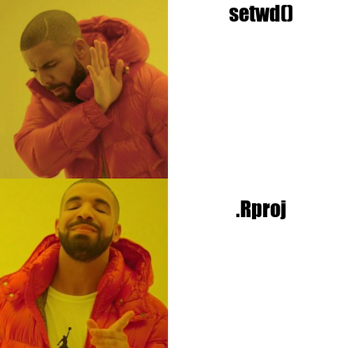
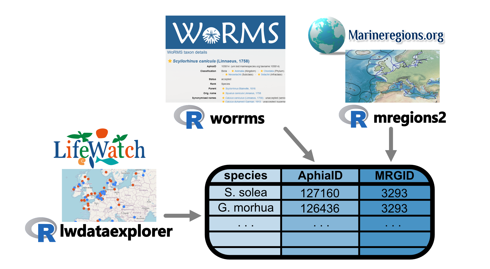
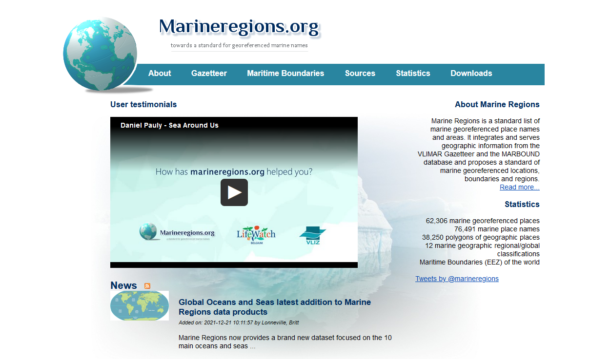
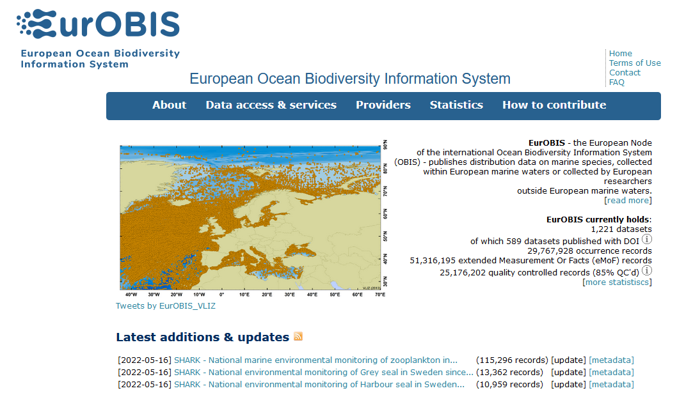
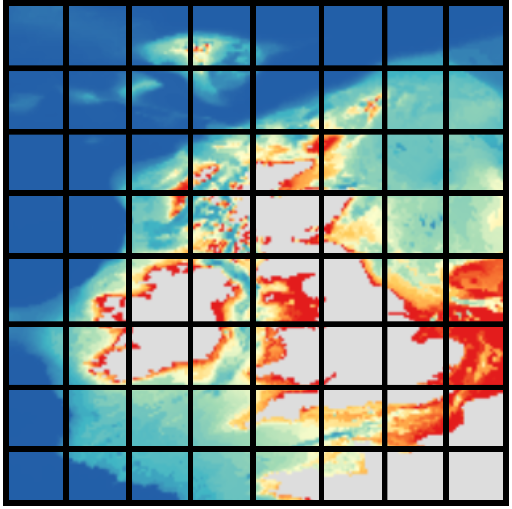

```{r setup, include=FALSE}
knitr::opts_chunk$set(
  collapse = TRUE,
  comment = "#>",
  cache = TRUE,
  warning=FALSE,
  message = FALSE
)
```


<div style="font-size: 43px;" >
Bringing together marine biodiversity, environmental and maritime boundaries data in R
</div>

Salvador Fernandez, 
Laura Marquez, 
Lotte Pohl

May 30th 2022

<button style="width:26%">
  
</button>

<button style="width:26%">
  
</button>

---


<!-- <div style="font-size:25px"> </div> -->

Many more workshops! Discover [*here*](https://www.biodiversity.be/5147/)

 - June 9, 9:30 - 16:30 (register [*here*](https://tinyurl.com/yckurpft)) <br>*Linking occurrence data with environmental variables from the ecotopes*
 - June 29, 09:00 - 17:00 (register [*here*](https://forms.gle/eHsQFze8sLJzPnxq9))<br>*Explore GBIF from the Cloud*
 
 - September 27, 09:30 - 16:30 (register [*here*](https://docs.google.com/forms/d/1SFvlAdIe0YviE7tW0uSffFo7TvnI5S27I-844rWeT00/edit))<br>*Research Data Management workshop: Hands-on introductions to research data management and  publication*
 

<!-- <br> -->

<!-- Workshop 7 organised by [**INBO**](https://www.vlaanderen.be/inbo/en-gb/homepage/):   -->
<!-- <br> -->
<!-- FAIR biodiversity data: what, why and how? -->
<!-- <br> -->
<!-- June 2, 10 - 12 a.m -->
<!-- <br> -->
<!-- Register [**here**](https://tinyurl.com/3d2z6nkm) -->
<!-- write about INBO workshop in Email -->

# The Story

<!-- Having rapid access to reliable and accurate information is vital in different areas: conservation, research, and in creating policies and legislation to protect vulnerable areas of our coasts and oceans. 

(1) However, we have several sources of information where we can obtain a diverse set of data from and different ways to obtain it. 

so the question is what is the workflow that allows us to obtain data and work with it in the most easy straightforward way possible? -->


<!-- ## The Story -->

<!-- There is a diverse set of stakeholders, from academia, industry, funding agencies and scholarly publishers can benefit from having a workflow to access standardized marine biological, chemical, physical, and other different types of data. -->

<!--  -->

## The Story
<!-- An important user of the databases that we are going to work with today is the scientific community. For scientists, obtaining this kind of information is useful to create the basis of different projects or even to obtain data they need to carry them out. Some of the questions that arise for them when creating such projects are -->


## The Story


## The Story


## The Story


## Who we are

<button style="width:26%">
  
  <br> <div style="font-size:30px">Salva Fernandez</div> <br/> <div style="font-size:25px">VLIZ <br/>Science Officer</div><br/><div style="font-size:20px"> salvador.fernandez@vliz.be</div>
</button>

<!-- mention that we (Salva) are maintaining R packages in case you have any questions about that either now or in the future -->

<button style="width:43%">
  
  <br> <div style="font-size:30px">Laura Marquez</div> <br/> <div style="font-size:25px">VLIZ <br/>Science Officer</div><br/><div style="font-size:20px"> laura.marquez@vliz.be</div>
</button>

<button style="width:25%">
  
  <br><div style="font-size:30px">Lotte Pohl</div> <br/> <div style="font-size:25px">VLIZ/IMBRSea <br/>Intern</div><br/><div style="font-size:20px"> lotte.pohl@imbrsea.eu</div>
</button>

## The Species
<!-- To answer those type of questions is the aim of this workshop. We are going to learn how to query, access and obtain the data hold in different European Marine databases and for that we are going to work with some of the representative species: 
Anguila, carp, catfish, the common roach, codfish and flounder.
-->
<br/>
<br/>
<br/>
<br/>


<!-- <button style="width:27%"> -->
<!--    -->
<!-- </button> -->

<!-- <button style="width:30%"> -->
<!--    -->
<!-- </button> -->

<!-- <button style="width:30%"> -->
<!--    -->
<!-- </button> -->

<!--  -->

<!-- ## The Species -->
<!--  -->

<!-- ## The Species -->
<!--  -->

<!-- ## The Species -->
<!--  -->

<!-- ## The Species -->
<!--  -->

<!-- ## The Species -->
<!--  -->

## What we will learn

<!-- We will learn to visualize and get them ready for further exploration and analyses. All using the R packages available from different European initiatives: lwdataexplorer, eurobis, worrms, mregions, sdmpredictors.
-->
 1. Standardize your data
 
 2. Retrieve more data to include in analysis later on
 
 3. Get environmental data
 
 4. Combine it all into 1 dataset

 <!-- 1. How to access, query and obtain the data -->

 <!-- 2. Visualize and get them ready for further exploration and analyses using R -->

<!-- <br> -->
<!-- <br> -->

 - R packages: 
     - **lwdataexplorer** ([documentation](https://lifewatch.github.io/lwdataexplorer/index.html), [github](https://github.com/lifewatch/lwdataexplorer))
     - **eurobis** ([documentation](http://lifewatch.github.io/eurobis/), [github](https://github.com/lifewatch/eurobis))
     - **worrms** ([documentation](https://docs.ropensci.org/worrms/), [github](https://github.com/ropensci/worrms))
     - **mregions2** ([documentation](http://lifewatch.github.io/mregions2/), [github](https://github.com/lifewatch/mregions2/))
     - **sdmpredictors** ([documentation](http://lifewatch.github.io/sdmpredictors/), [github](https://github.com/lifewatch/sdmpredictors))
     - **emodnetWFS** ([documentation](https://emodnet.github.io/EMODnetWFS/), [github](https://github.com/EMODnet/EMODnetWFS/))


<!-- ## Exercises *(TBD)* -->

<!--   1. Get and standardize data -->

<!--       * [LifeWatch](https://lifewatch.be): Get marine taxon occurrences -->
<!--       * [WoRMS](https://www.marinespecies.org): Get standardised taxon info -->
<!--       * [marineregions](https://marineregions.org): Get standardised geospatial data -->

<!--   2. Get more occurrence data -->

<!--       * [EurOBIS](https://www.eurobis.org): Get marine taxon occurrences -->

<!--   3. Get environmental data -->

<!--       * [Bio-ORACLE](https://bio-oracle.org): Get pH, temperature & salinity -->
<!--       * [EMODnet Biology](https://emodnet-biology.eu): Get seabed habitats & human activities -->

<!--   4. Combine it all together -->

  
## Exercises
<br>


## Timeline (13:30 - 16:30)

  1. **Introduction** *(13:30 - 14:00)*
  
  2. **Exercise 1** *(14:00 - 14:45)*
  
  3. **Break** *(14:45 - 15:00)*
  
  4. **Exercise 2** *(15:00 - 15:30)*
  
  5. **Exercise 3** *(15:30 - 15:45)*
  
  6. **Break** *(15:45 - 16:00)*
  
  7. **Exercise 4** *(16:30 - 16:15)*
  
  8. **Close-off** *(16:15 - 16:30)*


## House Rules

 - This is a collaborative workshop! 🙌 Let's share our solutions in [this google document](https://docs.google.com/document/d/1n2_0lDrOyFIqapo85NA_0cH2qJPDE1P2HOlTw5ANYK8/edit?usp=sharing)
 - These slides are available online at  [lifewatch.github.io/ebr-2022-data-combine](https://lifewatch.github.io/ebr-2022-data-combine)
 - You can ask questions online via Q&A, or shout if you are in Brussels 📣
 - Make sure you are using `renv`.
 - Use the RStudio projects!

<!-- ```{r meme_getwd, echo = FALSE} -->
<!-- library(memer) -->
<!-- meme_get("HotlineDrake") %>% -->
<!--   meme_text_drake("setwd()", ".Rproj") -->

<!-- ``` -->



<!----------------------------------------------->
<!--                                           -->
<!--             Begin Exercise 1              -->
<!--                                           -->
<!----------------------------------------------->

# Exercise 1



<!-- Speaker Note: Introduce ETN -->

**Use your own data!**

## Exercise 1

</br>

</br>
<small>Source: https://xkcd.com/927/</small>

## Dataset example: Belgian LifeWatch Observatory data

<a href="https://www.lifewatch.be/en/data">

</a>

Access in R with [lwdataexplorer](https://lifewatch.github.io/lwdataexplorer/index.html)

## Dataset example: Belgian LifeWatch Observatory data

```{r lwdata1, results = 'hide'}
library(lwdataexplorer)

zoo <- getZooscanData("2021-01-01", "2022-01-01")

head(zoo)
```

```{r lwdata1-1, echo = FALSE}
library(kableExtra)

kbl(head(zoo)) %>%
  kable_paper() %>%
  scroll_box(width = "100%", height = "300px")
```

## Dataset example: Belgian LifeWatch Observatory data

We will transform the dataset into a **Simple Feature** object:

```{r lwdata2}
library(sf)

class(zoo)

zoo_sf <- st_as_sf(zoo, coords = c("Longitude", "Latitude"), crs = 4326, remove = FALSE)

class(zoo_sf)

```

- `sf` [cheatsheet here](https://raw.githubusercontent.com/rstudio/cheatsheets/main/sf.pdf)
- [Coordinate Reference Systems (CRS)](https://docs.qgis.org/2.18/en/docs/gentle_gis_introduction/coordinate_reference_systems.html): _provide a standardized way of describing locations_
<br> 
<small>https://www.nceas.ucsb.edu</small>

## Dataset example: Belgian LifeWatch Observatory data
```{r lwdata3}
library(mapview)
mapview(zoo_sf)
```


## Dataset example: Belgian LifeWatch Observatory data

<a href="https://lifewatch.be/ETN/">

</a>

```r
# Access ETN with lwdataexplorer
etn <- getEtnData()
```

## Taxonomic match with WoRMS

<a href="https://www.marinespecies.org/index.php">

</a>

## Taxonomic match with WoRMS
```{r worrms1, results = 'hide'}
library(worrms)

taxa <- wm_records_taxamatch("Caretta caretta")

taxa[[1]]

```

```{r worrms1-1, echo = FALSE}
library(kableExtra)

kbl(taxa[[1]]) %>%
  kable_paper() %>%
  scroll_box(width = "100%", height = "200px")
```

See the `worrms` R package [documentation here](https://docs.ropensci.org/worrms/)

## AphiaID: Unique identifier of a taxon in WoRMS

```
https://www.marinespecies.org/aphia.php?p=taxdetails&id=137205
```


## Geographic standard: Marine Regions Gazetteer

<a href="https://marineregions.org/">

</a>

## Geographic standard: Marine Regions Gazetteer
```{r mregions2-1, results = 'hide'}
library(mregions2)

# Find all region names starting with "Belgian"
belgian_gaz <- mr_gaz_records_by_names("Belgian")
belgian_gaz
```

```{r mregions2-1-1, echo = FALSE}
kbl(belgian_gaz) %>%
  kable_paper() %>%
  scroll_box(width = "100%", height = "300px")
```

See the `mregions2` R package [documentation here](https://github.com/lifewatch/mregions2)

## Geographic standard: Marine Regions Gazetteer

```{r mregions2-2}
# Get only Belgian Territorial Sea
library(mapview)
territorial_sea <- mr_gaz_record(49010)
mapview(territorial_sea)
```


## MRGID: Unique identifier of a record of the [marineregions.org](https://marineregions.org/mrgid.php) Gazetteer

```
https://marineregions.org/gazetteer.php?p=details&id=3293
```


## Spatial filtering

We will perform an spatial intersection


## Spatial filtering

We will perform an spatial intersection


## Spatial filtering

We will perform an spatial intersection


## Spatial filtering

```{r spfilter, message=FALSE}
library(sf)

nrow(zoo_sf)

zoo_sf_belgium <- st_intersection(zoo_sf, territorial_sea)

nrow(zoo_sf_belgium)
```

## Spatial filtering
```{r spfilter1}
mapview(list(zoo_sf, territorial_sea))
```

## Spatial filtering
```{r spfilter2}
mapview(list(zoo_sf_belgium, territorial_sea))
```

## Exercise 1

`./src/exercises/01_standardize.R`

```{r exercise1, results='asis', echo=FALSE}
cat(c("```r", readLines("../exercises/01_standarize.R"),"```"), sep = "\n")
```

# 15 min. Break!

<br/>


<!----------------------------------------------->
<!--                                           -->
<!--             Begin Exercise 2              -->
<!--                                           -->
<!----------------------------------------------->

# Exercise 2


## EurOBIS

<a href="https://eurobis.org/">

</a>


## EurOBIS
Example: get all occurrences of the Atlantic Cod (_Gadus morhua_; aphiaID = [126436](https://marinespecies.org/aphia.php?p=taxdetails&id=126436)) in the Belgian Part of the North Sea (MRGID = [3293](https://marineregions.org/mrgid/3293)

```{r eurobis1, results='hide'}
library(eurobis)
df <- eurobis_occurrences_basic(aphiaid = 126436, mrgid = 3293)
head(df)
```

```{r eurobis1-1, echo = FALSE}
kbl(head(df)) %>%
  kable_paper() %>%
  scroll_box(width = "100%", height = "300px")
```

See the `eurobis` R package [documentation here](http://lifewatch.github.io/eurobis/)

## EurOBIS
```{r eurobis1-2}
mapview(df)
```

## Data manipulation in R: dplyr

We will work with `dplyr`. It uses pipes (`%>%`) to increase code readability and avoid nesting

```r
# base R
df$datecollected <- as.Date(df$datecollected)
```

```r  
# dplyr
library(dplyr)
df <- df %>%
  mutate(datecollected = as.Date(datecollected))
```

- `sf` [cheatsheet here](https://raw.githubusercontent.com/rstudio/cheatsheets/main/data-transformation.pdf)


## Exercise 2

`./src/exercises/02_eurobis.R`

```{r exercise2, results='asis', echo=FALSE}
cat(c("```r", readLines("../exercises/02_eurobis.R"),"```"), sep = "\n")
```


<!----------------------------------------------->
<!--                                           -->
<!--             Begin Exercise 3              -->
<!--                                           -->
<!----------------------------------------------->

# Exercise 3


<!-- ## Notes -->
<!--   - EMODnet: European Marine Observation and Data Network -->
<!--  - `eurobis` R package: uses the EMODnet-Biology webservices -->
<!--   - there are web services for other types of data:  -->
<!--    - physical -->
<!--    - seabed habitats -->
<!--    - human activities -->
<!--  - `EMODnetWFS` R package: can access all these data -->
<!--  - WFS: Web Feature Service (provides access to vector data) -->
<!--  - Accessing raster data: available later in 2022 -->

## Raster vs Vector Data
<br>
<br>
<br>

<button style="width:49%">
  
  <br><div style="font-size:30px"> raster layer</div>
</button>

<button style="width:49%">
  
  <br> <div style="font-size:30px">vector layer</div>
</button>

<!-- I know the raster img itself has poor resolution but I haven't figured out yet how to include vector images in revealjs -->

## EMODnetWFS

Explore and download geospatial data from EMODnet. 
```{r emodnetwfs0, results='hide'}
library(EMODnetWFS)

emodnet_wfs()
```

```{r emodnetwfs0-1, echo=FALSE}
kbl(emodnet_wfs()) %>%
  kable_paper() %>%
  scroll_box(width = "100%", height = "250px")
```
See the `EMODnetWFS` R package [documentation here](https://emodnet.github.io/EMODnetWFS/)


## EMODnetWFS

```{r emodnetwfs1, results='hide', message=FALSE}
# First create a WFS client
client <- emodnet_init_wfs_client("seabed_habitats_general_datasets_and_products")

class(client)
#> [1] "WFSClient"         "OWSClient"         "OGCAbstractObject" "R6"

# And ask for all the layers available
info <- emodnet_get_wfs_info(client)
info
```

```{r emodnetwfs1-1, echo=FALSE}
kbl(info) %>%
  kable_paper() %>%
  scroll_box(width = "100%", height = "300px")
```

## EMODnetWFS: Download one layer

```{r emodnetwfs3, results='hide'}
# Download sandbank layer
emodnet_layer <- emodnet_get_layers(client, layers = "art17_hab_1110", 
                            crs = 4326, reduce_layers = TRUE)
class(emodnet_layer)
#> [1] "sf"         "data.frame"

head(emodnet_layer)
```

```{r emodnetwfs3-1, echo=FALSE}
kbl(head(emodnet_layer)) %>%
  kable_paper() %>%
  scroll_box(width = "100%", height = "300px")
```

## EMODnetWFS: Download one layer

```{r emodnetwfs3-2}
# Some editing needed to be able to plot
emodnet_layer <- emodnet_layer %>% 
  st_cast(to = "GEOMETRYCOLLECTION") %>% 
  st_collection_extract(type = "POLYGON")

mapview(emodnet_layer)
```


## Bio-Oracle

Marine data layers for ecological modelling

- `sdmpredictors` can download Bio-Oracle layers
- More info at [bio-oracle.org](https://bio-oracle.org/index.php) 

```{r sdm1, results='hide'}
library(sdmpredictors)
library(raster)

# Find all layers available from the latest version
list_layers("Bio-ORACLE", version = 2.2)
list_layers_future("Bio-ORACLE", version = 2.2)

# Pass layer code for max sea surface temperature
load_layers("BO22_RCP26_2050_chlomean_ss")
```

See the `sdmpredictors` R package [documentation here](http://lifewatch.github.io/sdmpredictors/)

## Bio-Oracle
```{r sdm2, results='hide'}
list_layers("Bio-ORACLE", version = 2.2)
```

```{r sdm2-1, echo = FALSE}
kbl(list_layers("Bio-ORACLE", version = 2.2)) %>%
  kable_paper() %>%
  scroll_box(width = "100%", height = "400px")
```

## Bio-Oracle
```{r sdm3, results='hide'}
list_layers_future("Bio-ORACLE", version = 2.2)
```

```{r sdm3-1, echo = FALSE}
kbl(list_layers_future("Bio-ORACLE", version = 2.2)) %>%
  kable_paper() %>%
  scroll_box(width = "100%", height = "400px")
```

## Bio-Oracle
```{r sdm4}
bio_oracle <- load_layers("BO22_RCP26_2050_chlomean_ss")
bio_oracle
```

## Bio-Oracle
```{r sdm5}
raster::plot(bio_oracle)
```

## Exercise 3

`./src/exercises/03_environmental.R`

```{r exercise3, results='asis', echo=FALSE}
cat(c("```r", readLines("../exercises/03_environmental.R"),"```"), sep = "\n")
```

# Survey time!

We would love to hear from you! <br/>
Please fill out [this questionnaire!](https://docs.google.com/forms/d/1YUC01T3boQ2RNrsGwmuwCDzSCR5GPiZHn-tvOM60_04/edit) 📝, it will only take a couple minutes.


<br/>

<br/>
15m. break


<!----------------------------------------------->
<!--                                           -->
<!--             Begin Exercise 4              -->
<!--                                           -->
<!----------------------------------------------->


# Exercise 4


## Spatial Join

The points will get the values from the polygon


More info: http://wiki.gis.com/wiki/index.php/Spatial_Join

## Spatial Join

The points will get the values from the polygon


## Spatial Join

The points will get the values from the polygon


## Spatial Join

Warning: same principle but works different!

Vector data
```r
library(sf)

st_join(df, emodnet_layer)
```

Raster data
```r
library(raster)

df_as_sp <- sf::as_Spatial(df)

raster::extract(bio_oracle, df_as_sp)
```

## Exercise 4

```{r exercise4, results='asis', echo=FALSE}
cat(c("```r", readLines("../exercises/04_combine.R"),"```"), sep = "\n")
```

# Recap: Data Sources


# Questions? Contact us!

<button style="width:26%">
  
  <br> <div style="font-size:30px">Salva Fernandez</div> <br/> <div style="font-size:25px">VLIZ <br/>Science Officer</div><br/><div style="font-size:20px"> salvador.fernandez@vliz.be</div>
</button>

<button style="width:43%">
  
  <br> <div style="font-size:30px">Laura Marquez</div> <br/> <div style="font-size:25px">VLIZ <br/>Science Officer</div><br/><div style="font-size:20px"> laura.marquez@vliz.be</div>
</button>

<button style="width:25%">
  
  <br><div style="font-size:30px">Lotte Pohl</div> <br/> <div style="font-size:25px">VLIZ/IMBRSea <br/>Intern</div><br/><div style="font-size:20px"> lotte.pohl@imbrsea.eu</div>
</button>

<br><br>
[Or open an issue on GitHub!](https://github.com/vlizBE/ebr-2022-data-combine/issues)

and don't forget to [fill out our survey](https://docs.google.com/forms/d/1YUC01T3boQ2RNrsGwmuwCDzSCR5GPiZHn-tvOM60_04/edit) 📝


```{r render, include = FALSE, eval = FALSE}
rmarkdown::render("slides.Rmd", output_dir = "../../docs", output_file = "index.html")
```